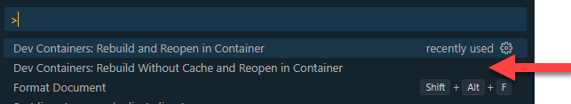
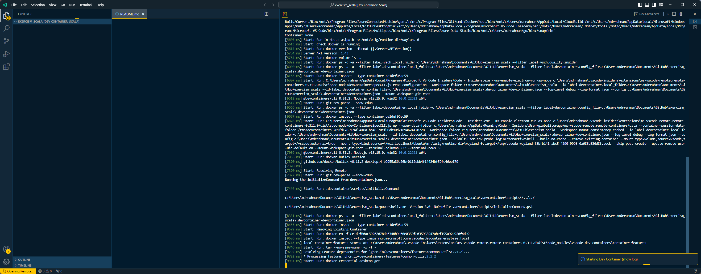
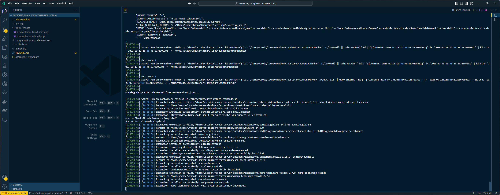
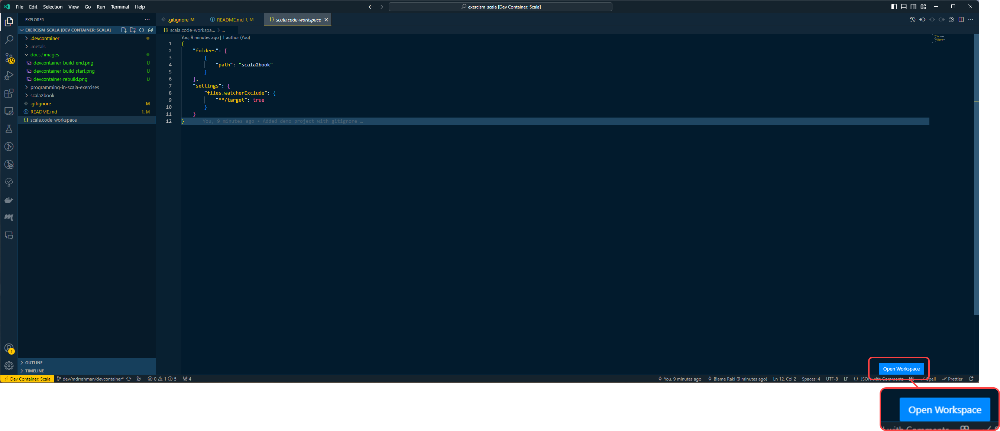
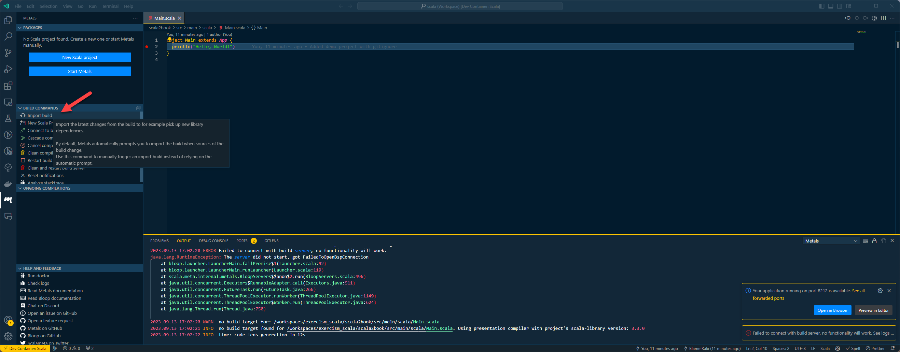
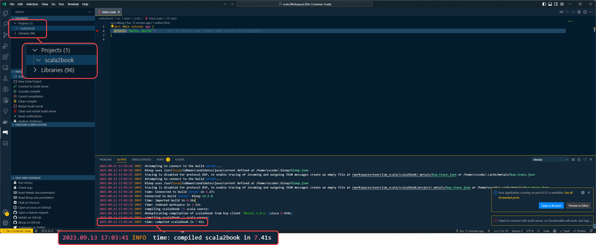
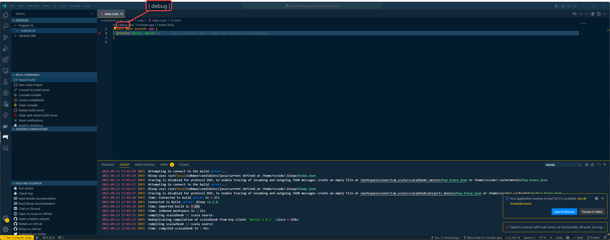
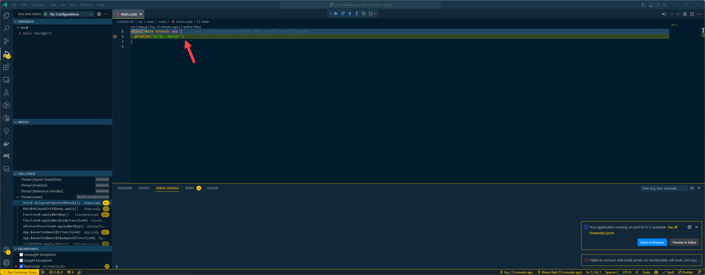

# Learning Scala

<!-- TOC -->

- [Learning Scala](#learning-scala)
  - [Book](#book)
  - [Dev Container](#dev-container)

<!-- /TOC -->

## Book

- [Programming in Scala](https://people.cs.ksu.edu/~schmidt/705a/Scala/Programming-in-Scala.pdf)
- [Book Excercises](https://booksites.artima.com/programming_in_scala) - see [Mini Website](/programming-in-scala-exercises/index.html)

## Dev Container

To open in devcontainer:

```text
Ctrl + Shift + P > Rebuild Without Cache and Reopen in Container
```



Build starts:


Build ends:


To get metals and debugging to work in VSCode, Click on `scala.code-workspace`:



Go to the `metals` tab, and `Import Build`:



Metals will kick off a compile:



And debugging should work:



